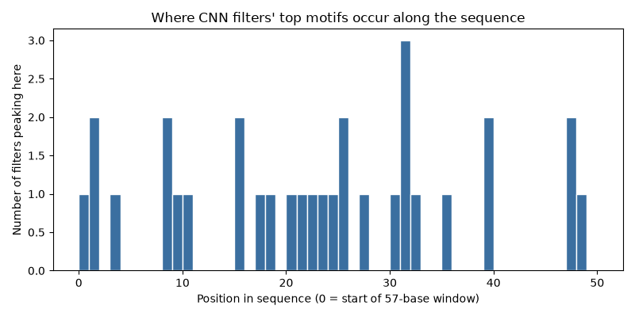
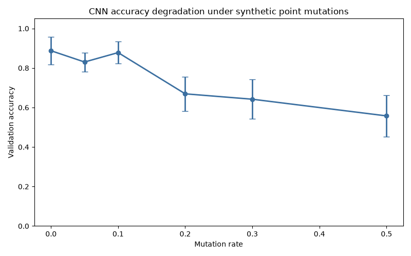

# Promoter Region Classification

A small CNN project that predicts whether a 57-base DNA sequence from *E. coli* is a promoter region or not, built to practice sequence modeling and get real GPU/CUDA experience in PyTorch.

## Data

106 sequences from UCI's "Molecular Biology (Promoter Gene Sequences)" dataset, 53 promoters and 53 non-promoters, each 57 bases long. Every sequence is one-hot encoded (each base becomes a 4-value vector), so the full input is a (106, 57, 4) array.

## Models

Two models, trained and compared with 5-fold stratified cross-validation:

- **Baseline** – a single linear layer on the flattened one-hot input. Gives a number to beat before adding any real architecture.
- **CNN** – `Conv1d -> ReLU -> AdaptiveMaxPool1d -> Linear`. The convolution slides an 8-base window across the sequence, so it can pick up short positional motifs the baseline can't see.

## Results

| Metric | Baseline | CNN |
|---|---|---|
| Accuracy | 0.8212 ± 0.0534 | 0.8874 ± 0.0695 |
| Precision | 0.8632 ± 0.0930 | 0.9244 ± 0.0657 |
| Recall | 0.7745 ± 0.0392 | 0.8527 ± 0.1471 |
| F1 | 0.8140 ± 0.0512 | 0.8774 ± 0.0806 |
| ROC-AUC | 0.9093 ± 0.0441 | 0.9683 ± 0.0176 |

The CNN wins across every metric, not just accuracy, which rules out the win being a fluke of one class. Its recall does swing more from fold to fold than the baseline's, which tracks with it having more parameters relative to only ~85 training examples per fold — more room to overfit fold-specific quirks.

**Aggregated confusion matrices** (summed across all 5 folds, so each covers all 106 examples):

- CNN: TN 49, FP 4, FN 8, TP 45 (12 errors total)
- Baseline: TN 46, FP 7, FN 12, TP 41 (19 errors total)

Both models miss real promoters more often than they falsely flag non-promoters, but the CNN makes fewer mistakes of both kinds.

## What the CNN actually learned

The first conv layer has 32 filters, each an 8-base pattern detector. Running every sequence through the trained layer and finding where each filter fires strongest pulls out the actual DNA snippet that filter responds to — turning 32 opaque weight matrices into 32 readable motifs.

A few things stood out:

- Two pairs of filters converged on identical motifs at identical positions, and one filter never activated at all — signs the model has more capacity than this dataset really needs.
- Several filters landed on AT-rich fragments, and their peak positions cluster in two regions of the sequence. Given this dataset's window spans roughly -50 to +7 relative to the transcription start site, those clusters land suggestively close to where the real -35 and -10 promoter boxes sit in *E. coli*. Worth stating as a suggestive pattern, not a proven one, given the small sample.

## Robustness to mutation

To check whether the CNN learned real signal or just memorized training sequences, I injected random point mutations into each fold's validation sequences at increasing rates and re-ran them through that fold's trained model:

| Mutation rate | Accuracy |
|---|---|
| 0% | 0.8874 ± 0.0695 |
| 5% | 0.8303 ± 0.0480 |
| 10% | 0.8779 ± 0.0552 |
| 20% | 0.6693 ± 0.0868 |
| 30% | 0.6420 ± 0.1003 |
| 50% | 0.5576 ± 0.1056 |

Performance holds up through about 10% mutation, then drops sharply between 10% and 20%, eventually settling near the 50% chance floor for a balanced binary task. That's consistent with the model relying on specific intact motifs rather than having memorized exact sequences. The dip at 5% sitting below the 10% point is likely just noise from small validation folds (~21 examples each) rather than a real effect.

## Setup

PyTorch (CUDA build if you have a GPU), NumPy, scikit-learn, pandas, and Matplotlib. Everything lives in `promoter_region_classification_gpu.py`.